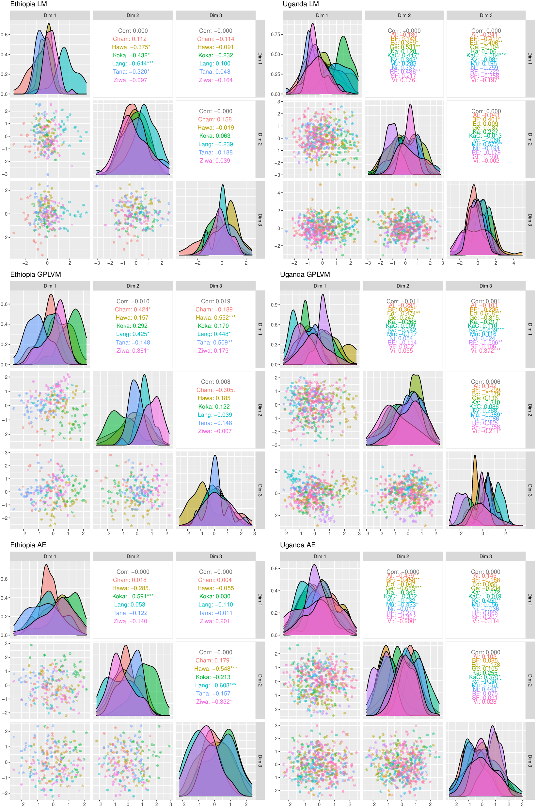
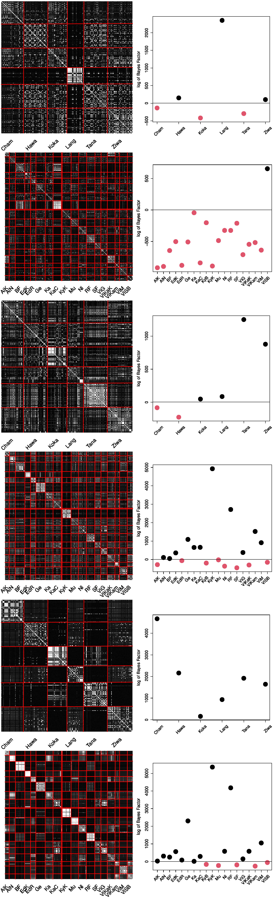

# MorphoML

This repository contain the data and software used for our publication *Investigating the Explanatory Power of Shape Variation Using Generalized Procrustes Analysis and Machine Learning*. 
If you use this software, please be sure to cite our paper.

# About this Repository

This repository contains all data sources and scripts to reproduce the results of our paper. Nevertheless, this may takes some days (especially the conv. autoencoder). For the publication, the following hardware was used

- NVIDIA Gefore RTX 3080: The deep learning models are optimized for NVIDIA hardware. If you are running on a CPU rather than GPU, you need to adapt the installation script (just remove the '-gpu' in the tensorflow line). However, we do not recommend to run the software on a CPU. It will take forever.
- AMD Ryzen 9 3900X: GPy for B-GP-LVM as well as all analysis scripts (except the autoencoder prediction, thats GPU again) runs on this CPU. Based on this 12-core machine, the GP-LVM modesl convered in a cupple of days.
- Harddisk: All results as well as the data contains ~60 GB od data.The cAE models take a lot of space.

However, the software will fail to run if you use different NVIDIA hardware driver. For the purpose of this study, CUDA 11.2 was used. In order to reproduce our results eaily, we recommend to use [this NVIDIA Docker container](https://github.com/NVIDIA/nvidia-docker) as well [this general machine learning Docker container](https://github.com/nielsborie/ml-docker). Furthermore we used cran R 4.1.2 and Python 3.8.10.

## Folder Structure

We organized the materials including software of this structure as follows:

- **Analysis**: All scripts to investigate the machine learning/GPA results. This includes Spearmans rank correlation test, cAE model selection, multivariate analysis, pCA and GPA hypothese tests.
- **Autoencoder**: The Python scripts for image data pre-processing and cAE optimization relying on Keras.
- **GPLVM**: All bash and Python scripts used for data processing as well as latent space visualization.
- **preProc**: Pre process files. This studies analysis relies on the files in this folder. This folder includes the landmarks, images and meta data.
- **Procrustes**: GPA cran R script. The resulting files are located here.
- **Python**: Installation script (see below) as well as basic scripts for GP-LVM as well as feature visualization.

All scripts must be run in the sub folders - relative paths were used.

**Note**: Due to the limitation of this repository, the raw data files cannot be proposed. Thus, the learning matrices must be downloaded [HERE](https://cloud.technikum-wien.at/s/nQ5mGQxQAcS7jdo). Please download the files and move them to the *preProc* folder.

## Installation

We provide an installation file in the root directory. This script runs the requirement files in the Python folder. Afterwards, two Python virtual environments are available for data processing. You may need to adapt the paths in the bash scripts for your system.

You need to run this installation script before any processing. **Note**, that this installation does not include the cran R packages. We relied on the RStudio for installation.

## Results

All results are stored in the sub folders. You can investigate further results relying on the results stored in the files. We appreciate all comments to our work. If you have any questions or comment please write an email to woeber@technikum-wien.at.

**Note**: You have to go through all the scripts and run them by yourself in order to get results. This includes the manual selection of the features obtained by the machine learning models. For this task, a selection script is included in the learning scripts. A window will open and you can select approrpiate features using the 'y' (yes, we want to use this feature) and 'n' (no, please ignore it). Thsi will generate a *selection.csv* file in all of your model folders.

The results we obtained are visualized in the following figures.
**Note**: This is machine learning. You will definitly get different results. Since we initialize the GP-LVM using the PCA, the results are rather stable. However the cAE features will differ significantly. 

The features/GPA scaled coordinates are summarized in the following 3D multivariate plot:

Since there are obvious overlappign population distributions we applied pCA to the data and obtained following pCA matrices (left side). Furthermore, we applied a Bayes factor based hypothese test (right side), where the red dots indicates insignificant population logation discriminability.
The following plots are ordered as follows: GPA Ethiopia/Uganda, GP-LVM Ethiopia/Uganda, cAE Ethiopia/Uganda.

